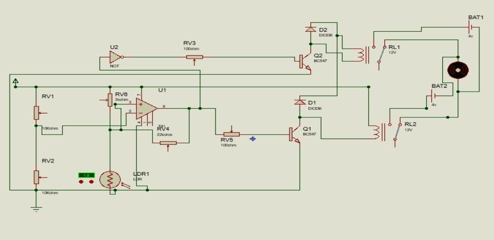

# ShowCase

CHAPTER I : INTRODUCTION

The Automatic Roof Closing System utilizes a Light Dependent Resistor (LDR) to detect changes in light intensity. When the LDR senses a significant decrease in light intensity, indicating the presence of rain or excessive sunlight, it triggers the system to close the roof automatically.

1.1	Background 

The background discusses the need for an automatic roof closing system, 
especially in places prone to sudden weather changes , where manual 
operation is inconvenient. It introduces the idea of using an operational  
amplifier(op-amp) and a Light Dependent Resistor (LDR) to achieve this 
automation.
When the light falls on LDR, the roof automatically opens using DC motor 
and at night, the roof closes automatically.

1.2 Motivation 

The motivation behind this project is to develop an Automatic Roof Closing System using Light Dependent Resistor (LDR) technology to address the challenges posed by unpredictable weather. This system aims to enhance the usability, comfort, and safety of outdoor spaces by automatically closing the roof when adverse weather conditions are detected.

1.3	 Problem Description
 
Some of the Problems to be solved in the Project: 

Regulating temperature and Light for plants ( green house): 
                  This will result in better growth of the plants.

Safety and Security : It will Protect the house from thief and other birds   
animals during night time.

Convenience: The roof automatically adjusts to sunlight levels, reducing the need for manual operation.

 Fading of furniture and fabrics: Prolonged sun exposure can fade the colours of furniture. An Automatic closing roof system can prevent this by providing shade when needed.

1.4	Objectives

Some of the objectives of the project are:

 Enhanced Comfort : Maintain a comfortable indoor environment by controlling    the amount of sunlight entering the space. 

Energy Efficiency : Optimize the use of natural light and reduce the need for artificial lighting. When natural light is sufficient, the roof remains open, minimizing energy consumption for lighting.

1.5	Methodology:
 

1.6	 Limitations
1 The accuracy of the LDR sensor in detecting adverse weather conditions may be    affected by environmental factors such as dust or debris.
2	The motorized mechanism may have limitations in terms of speed and reliability.
3	The system may require periodic maintenance to ensure optimal performance.
4	The prototype may have limited scalability and may not be suitable for large-scale applications without further development.

1.7	 Organisation of Report
1-Introduction: Provides an overview of the project, including background, motivation, problem description, and objectives.
2	Literature Review: Summarizes existing research and technologies related to automatic roof closing systems and LDR technology.
3	Methodology: Describes the approach and steps taken to develop the Automatic Roof Closing System using LDR.
4	Results: Presents the findings and performance evaluation of the developed system.

1.8	 Summary
The Automatic Roof Closing System project aims to develop an innovative solution to protect outdoor spaces from adverse weather conditions. By leveraging LDR technology and a motorized mechanism, the system can automatically detect changes in light intensity and close the roof when rain or excessive sunlight is detected. While the system may have limitations, it offers significant potential to improve the usability, comfort, and safety of outdoor environments. 
CHAPTER II: TECHNOLOGY 
An automatic roof closing system using Light Dependent Resistors(LDRs) operates based on changes in light intensity.Here’s a breakdown of the technical background.
  Resistor :- 
                    100 kilo-ohm resistor is used in this circuit. It is often used as voltage divider network. This setup helps regulate the voltage reaching the LDR.  
 
  Diode :-
               Here IN 4007 diode is used. This diode protects the circuit by allowing a controlled path for the reverse voltage spike when the relay is turned offed.
 

  
           Transistor :-

          To complete this circuit we have used transistor BC 457 can switch on and off the relay based on the light condition defected by the LDR. As the light level changes, and this variation is amplified by the transistor to control the relay. It allows a small current variation from the LDR to control a larger current flowing through the relay.
  

Relay :-
                 Relay is electromagnetic switch. It is operated using very low voltage like 5v. In the circuit , 12v dc relay is used which provide electrical isolation between low voltage control circuit (usually driven by the LDR and associated components) and the higher voltage motor or load. This isolation helps protect the low voltage components from potential damage due to the higher voltage and current associated with the motor.
  

Motor :-
   Motor is electrical device which converts electrical into mechanical work. Here 12v dc motor is used in order to automatically close the roof.   

  LDR :-
              Light Dependent Resistor is a type of resistor whose resistance changes with the amount of light falling on it. It is based on the principle that , it’s resistance decreases when light intensity increases and resistance increases when light intensity decreases.
   

 
CHAPTER III: METHODOLOGY/SYSTEM MODELLING / EXPERIMENTAL SETUP 

 
FLOWCHART SHOWING THE OPERATION OF AUTOMATIC ROOF CLOSING         SYSTEM 
 
	
CHAPTER IV:-

RESULT AND ANALYSIS
During night; • motor will receive 4.07v from the circuit •
                  Motor will rotates in clockwise direction •
                     Roof will get closed. 
 
During Daytime; Motor will receive 3.98v from the circuit.
                  Motor will rotates in anti-clockwise direction                                                                                                                                                                         
                        Roof will get opened.
 

        Simulation:
 

Circuit Analysis:

• LDR Resistance at normal room light = 9.5kΩ 
• LDR Resistance at full dark = 19.5kΩ 
• LDR Resistance at smart phone flash light = 0.3kΩ ( Distance between the Light sensor and flash light is in between 1cm-3cm ) 
• Op amp output in smart phone flash light = 0.09v 
• Op amp output in dark = 0.78v 
• Op-amp and transistor output in smart phone flash light = 0v 
• Op-amp and transistor output in dark = 4.07v 

• NOT Gate and transistor output in smart phone flash light = 3.98v 
• NOT Gate and transistor output in dark = 0v

            
   Expenditure Table:

  

Hence , our overall expenditure is Nrs.1500 including glue stick, soldering aluminum wire, Screw , etc.
CHAPTER V: CONCLUSION AND FUTURE WORK
As all of us are searching for conveniences in each and every things. So, the implementation of automatic roof closing system will be great idea to meet the requirements of many people. Hence , we can conclude that, we can simply and automatically open or close the roof as our requirements by utilizing the natural light source.

FUTURE WORK

• Use of rain sensor instead of LDR 
• Mobile app control 
• Use of wind sensor
• Timer control based on desired schedule
    REFERENCE:
R. Gregorian, INTRODUCTION TO CMOS OP-AMP AND COMPARATOR 
• Malik Sikandar Hayat Khiyal, Aihab Khan, and Erum Shehzadi. SMS Based wireless Home Appliance control System (HACS) for Automating Appliances And Security, Issues in Informing Science and Information Technology. Vol.9.pp.887-894. 2009. 
• Franco, S.(2015). Design with operational amplifiers and Analog integrated circuit(4th ed). McGraw-Hill Education. 
• Hughes, A.,& Drury, B.(2019). Electric motors and drives: Fundamentals, types, and appliances (5th ed.). Newnes. 
• YouTube : channel names : Slide Canopy , Vetra furniture 
• Google Gemini 

